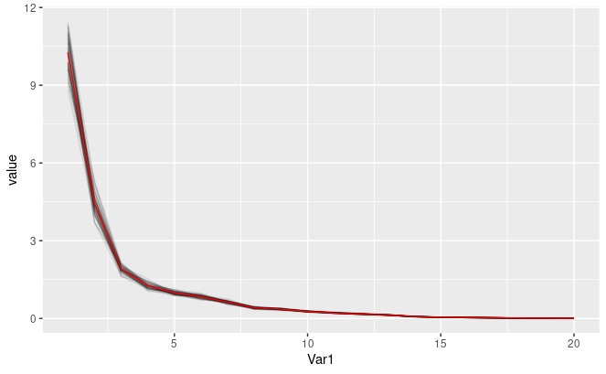
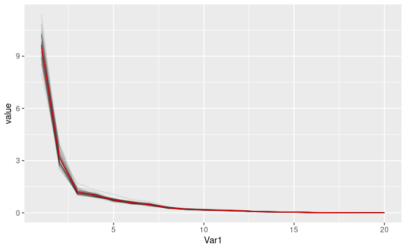
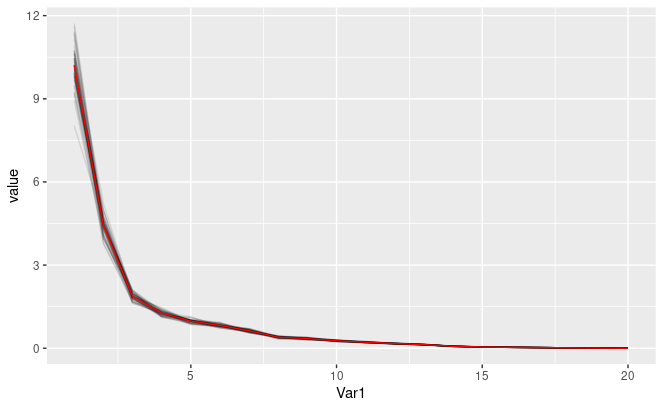

**Setup**

```{r, include=FALSE}
setwd("~/Library/CloudStorage/OneDrive-TheUniversityofWesternAustralia/Data Sets")

rm(list = ls())

if (!is.null(sessionInfo()$otherPkgs)) {
  invisible(
    lapply(paste0('package:', names(sessionInfo()$otherPkgs)), 
           detach, character.only=TRUE, unload=TRUE)
  )
}

options(stringsAsFactors = FALSE)
```

```{r, results='hide', message=FALSE, warning=FALSE, fig.show='hide'}
library(ggbiplot)
library(reshape2)
library(tidyverse)
library(MASS)
library(GGally)
library(mvtnorm)
library(scales)
library(ggpubr)
library(dplyr)
```

# Question 1

## (a) What does reproducible calculations and reproducible simulations refer to and when or why should the calculations/simulations be reproducible?

Reproducible calculation means that the result of the calculation will always be the same when given the same input to the calculation. The ability to reproduce simulations refers to the ability for a two separate users to run a simulation study and receive the same results given that they configure the model with the same parameters. Because the random number generators are deterministic, using and sharing fixed seed values with others will allow them to get the same results.

These are important in situations where you want to share your results with others since they may want to verify your results. If they re-run your code, they can see the results you generated. Reproduciblity is also helpful in debugging programs written to do simulation\

## (b) When is it a sensible strategy to use the Gaussian model in a simulation? When is it not and why? (Hint. Your answer could contain an illustrative example.)

It is sensible to use a gaussian given that the random data you're modelling can be reasonably expected to be drawn from a gaussian distribution.

This occurs in 2 main circumstances:

1.  When the data being modelled natrually comes from a gaussian (rare) - e.g. assuming gaussian noise on observations.

2.  The data you're modelling comes from realisations of sums/means of other random variables. Because of the central limit theorem, we know that the distribution of the sample mean is asymptotically normal. Example: looking at voter preferences in different districts (each district's "mean" outlook on a topic is a sample mean of individual results).

If your support is not all real numbers, then gaussian model is wrong (e.g. wait times in a queueing model). Gaussian distributions also have extremly flat tails, so they often underestimate "rare" events - therefore it might not be a good idea to model systems which have infrequent shocks (e.g. stock prices) with Gaussians. Gaussians are also unimodal & symmetric which may not correpsond to the system you are modelling.

## (c) Consider a random sample of observations X = [X1, . . . , Xn]. Why would we expect that, typically, the variables of the sample X are correlated, but the principal component scores obtained from these variables are not?

There are two main reasons why your observations may be correlated:

1.  The original sampling method was biased in some way, for example, if you used convenience sampling to draw your sample you can expect that they would have similar/correlated values.

2.  Your data comes from samples of a signal (e.g. each Xi is a sequence of stock prices) and since the whole market tends to move together, we would expect our Xis to be correlated.

Each "coordinate" in a principal component is orthogonal and the kth pc vector points in the a direction of kth most variance. Because of the orthognonality and because we have centered our data, the resulting PC vectors will be uncorrelated.

# Question 2

## (a) Show smoothed histograms of logLength and logPower separately for the two periods. Comment on the shapes of the histograms and how the change over time affects this shape.

```{r}
df = read.csv('aircraft.csv')
df0 = data.frame(
Year = df$Year,
Period = factor(df$Period),
logPower = log10(df$Power),
logSpan = log10(df$Span),
logLength = log10(df$Length),
logWeight = log10(df$Weight),
logSpeed = log10(df$Speed),
logRange = log10(df$Range))

df0 = within(df0, Period[Year<= 45] <- 1)
df0 = within(df0, Period[Year> 45] <- 2)

ggplot(df0, (aes(logLength,group = Period, colour = Period))) +
  geom_density()

ggplot(df0, (aes(logPower,group = Period, colour = Period ))) +
  geom_density()
```

For the smooth histogram for logLength, the density graph for both period is skewed to the right, indicating that the mean is less than the median. We can also see from the graph there are only one peak in the distribution for both period, indicating that they are unimodal.

However, the density graph for period 2 is less skewed to the right and more distributed across as compared to the density graph for period 1.

For the smooth histogram for logPower, the density graph for period 1 is not skewed and can be considered as a normal distribution. However, the density graph for period 2 is skewed to the left and is bimodal.

## (b) Construct contour plots of the 2D smoothed histograms of the pairs (logPower, logWeight) and (logSpeed, logLength). Describe the shapes of the density plot and discuss how they change over time.

```{r}
ggplot( df0, aes( logPower, logWeight ) ) +
geom_density_2d( ) +
geom_point( aes( colour = Period ), alpha = 0.6 ) +
theme( legend.position = "bottom")

ggplot( df0, aes( logSpeed, logLength ) ) +
geom_density_2d( ) +
geom_point( aes( colour = Period ), alpha = 0.6 ) +
theme( legend.position = "bottom")
```

For the first density plot which represent the 2D smoothed histograms of the pairs (logPower, logWeight). We can see that the graph is unimodel and is skewed in the direction of positive correlation for both periods, indicating a strong positive correlation between the speed and the weight of an aircraft. We can also observe from the graph that there are more plots of period 2 on the upper right quadrant, indicating that aircraft are designed to be more powerful and heavier over time.

For the second density plot which represent the 2D smoothed histograms of the pairs (logSpeed, logLength). We can see that the pattern of the graph is different for the two periods. For period 1, the graph is more concentrated and can be seen as a unimodel graph. However, for period 2, the graph is more distributed and can be considered as a multimodel graph. It can also be observed from the graph that, over the time, aircrafts are designed to be more specialised and are of more variation in speed and length, such as faster aircraft or longer aircraft.

## (c) For which pair of variables would you expect the largest change in correlation or shape of their density over time and why?

I would expect the pair of variable logSpeed, logLength to have the largest change in correlation or shape of their density over time. The density plot for the pairs (logPower, logWeight) shows consistent correlation between power and weight over the two periods. However, the density plot for the pairs (logSpeed, logLength) shows that the correlation between speed and length changes over time as we can see that the graph chages from unimodel to multimodel over the two periods.

# Question 3

## Loading data

```{r, results='hide', message=FALSE, warning=FALSE, fig.show='hide'}
aircraft <- read.csv('aircraft.csv')
```

Regrouping periods

```{r, results='hide', message=FALSE, warning=FALSE, fig.show='hide'}
aircraft$Period[aircraft$Year <= 42] <- 1
aircraft$Period[aircraft$Year > 42] <- 2
aircraft$Period <- as.factor(aircraft$Period)
str(aircraft)
```

```{r, results='hide', message=FALSE, warning=FALSE, fig.show='hide'}
log_aircraft <- data.frame(Year = aircraft$Year, Period = aircraft$Period)
log_aircraft$logPower <- log10(aircraft$Power)
log_aircraft$logSpan <- log10(aircraft$Span)
log_aircraft$logLength <- log10(aircraft$Length)
log_aircraft$logWeight <- log10(aircraft$Weight)
log_aircraft$logSpeed <- log10(aircraft$Speed)
log_aircraft$logRange <- log10(aircraft$Range)
str(log_aircraft)
```

### Period 1

```{r, results='hide', message=FALSE, warning=FALSE, fig.show='hide'}
log_aircraft1 <- log_aircraft[log_aircraft$Year <= 42,3:8]
tail(log_aircraft1)
str(log_aircraft1)
```

### Period 2

```{r, results='hide', message=FALSE, warning=FALSE, fig.show='hide'}
log_aircraft2 <- log_aircraft[log_aircraft$Year > 42,3:8]
head(log_aircraft2)
str(log_aircraft2)
```

## (a) Separately for the two periods selected in Q2, carry out a principal component analysis using `prcomp` based on the logged data (without scaling).

```{r, results='hide', message=FALSE, warning=FALSE, fig.show='hide'}

log_aircraft1_pr <- prcomp(log_aircraft1, center = F, scale = F)
log_aircraft1_pr
```

Period 1

```{r, results='hide', message=FALSE, warning=FALSE, fig.show='hide'}
log_aircraft2_pr <- prcomp(log_aircraft2, center = F, scale = F)
log_aircraft2_pr
```

## (b) Show eigenvalues plots for each of the two periods. Interpret the results.

Period 1

```{r}
log_aircraft1_ev <- data.frame(
      component = factor(seq_along(log_aircraft1_pr$sdev), 
                         labels = paste0("PC", seq_along(log_aircraft1_pr$sdev))),
      var_explained = log_aircraft1_pr$sdev^2
    )

ggplot(log_aircraft1_ev, aes(y = var_explained)) +
      geom_line(aes(x = component, group = 1)) +
      geom_point(aes(x = component)) +
      labs(x = "Component", y = "Variance Explained") +
      ggtitle("Eigenvalues - Period 1")

```

Period 2

```{r}
log_aircraft2_ev <- data.frame(
      component = factor(seq_along(log_aircraft2_pr$sdev), 
                         labels = paste0("PC", seq_along(log_aircraft2_pr$sdev))),
      var_explained = log_aircraft2_pr$sdev^2
    )

ggplot(log_aircraft2_ev, aes(y = var_explained)) +
      geom_line(aes(x = component, group = 1)) +
      geom_point(aes(x = component)) +
      labs(x = "Component", y = "Variance Explained") +
      ggtitle("Eigenvalues - Period 2")

```

## (c) Show score plots for the first three PCs for each period. Comment on the results.

Period 1 and Period 2

```{r}
pc_scores1 <- data.frame(log_aircraft1_pr$x)

pc1pc21 <- ggplot(pc_scores1, aes(x = PC1, y = PC2)) +
      geom_point(alpha = 0.5, colour = "blue") +
      ggtitle("Period 1")

pc1pc31 <- ggplot(pc_scores1, aes(x = PC1, y = PC3)) +
      geom_point(alpha = 0.5, colour = "blue") +
      ggtitle("Period 1")


pc_scores2 <- data.frame(log_aircraft2_pr$x)

pc1pc22 <- ggplot(pc_scores2, aes(x = PC1, y = PC2)) +
      geom_point(alpha = 0.5) +
      ggtitle("Period 2")

pc1pc32 <- ggplot(pc_scores2, aes(x = PC1, y = PC3)) +
      geom_point(alpha = 0.5) +
      ggtitle("Period 2")


figure <- ggarrange(pc1pc21, pc1pc31, pc1pc22, pc1pc32,
                    ncol = 2, nrow = 2)
figure
```

The above figure shows 4 score plots. The 2 plots at the top are the score plots for period 1 and the 2 plots at the bottom are for period 2. The PC1/PC2 plot for period 2 has less spread than the PC1/PC2 plot for period 1. The PC1 scores are negative. The PC2 and PC3 scores . The PC1/PC2 plots for both periods show that the

## (d) Which logged variable contributes most to PC1 for each period? Does this change across the two periods? Comments on the results.

Period 1 and Period 2

```{r}
biplot(log_aircraft1_pr, col = c("white", "blue"), xlim=c(-0.10, 0.0), ylim=c(-0.005, 0.005))
biplot(log_aircraft2_pr, col = c("white", "blue"), xlim=c(-0.10, 0.0), ylim=c(-0.005, 0.005))
```

```{r}
ggbiplot(log_aircraft1_pr)
ggbiplot(log_aircraft2_pr)
log_aircraft_pr <- prcomp(log_aircraft[,3:8], center = F, scale = F)
ggbiplot(log_aircraft_pr, col) +
  scale_color_discrete(name = '')
```

logWeight contributed the most to PC1 in both periods. It contributed slightly more in period 2 than period 1 and still remains as the most contributed variables across the 2 periods. logRange and logPower contributed immensely in period 2. This change might be due to companies favoring long-distance travels or aerodynamic frame designs.

## (e) Based on your analysis, discuss the main changes that have occurred over time.

All the variables are in the left quadrants. logRange and logSpeed are in the positive quadrant and the rest are in the negative quadrant in period 1 whereas in period 2, the variables are divided equally. logSpeed and logWeight are inversely correlated in both periods. logRange and logPower are also inversely correlated and this relationship became stronger in period 2.

The range and power changed drastically over the two periods. The correlation between these two variables became stronger.

# Question 4

The data set `ass2pop.csv` is available in the LMS folder 'Data sets'. It contains the means and covariance matrices corresponding to two populations. The first and second column of ass2pop.csv are the means $\mu_1$ and $\mu_2$ of the first and second population respectively; columns 3:22 correspond to the covariance matrix $\Sigma_1$ of the first population, and the remaining columns correspond to the covariance matrix $\Sigma_2$ of the second populations. In this question we generate random samples from these populations as described below.

## Normal Distribution Analysis

```{r}
set.seed(2733)
```

```{r}
ass2pop <- read.csv('ass2pop.csv', header=FALSE)
mean1 <- ass2pop$V1
mean2 <- ass2pop$V2

cov1 <- data.matrix(subset(ass2pop, select=V3:V22))
cov2 <- data.matrix(subset(ass2pop, select=V23:V42))

print(dim(cov1))
```

## (a) **Read the data into R. What is the dimension of the covariance matrix** $\Sigma_1$**?**

The covariance matrix is $20 \times 20$.

```{r, results='hide', message=FALSE, warning=FALSE, fig.show='hide'}

N1 <- 250
N2 <- 150
eig <- list()

samples1 <- rmvnorm(N1, mean=mean1, sigma=cov1)
samples2 <- rmvnorm(N2, mean=mean2, sigma=cov2)
samples <- rbind(samples1, samples2)
samplecov <- cov(samples)
print(round(samplecov, 2))
eigenresult <- eigen(samplecov)
vals <- list(eigenresult$values)
eig <- append(eig, vals)
save(vals, file="./eigens/normal_eigen/1.RData")

for (i in 2:50) {
  samples1 <- rmvnorm(N1, mean=mean1, sigma=cov1)
  samples2 <- rmvnorm(N2, mean=mean2, sigma=cov2)
  samples <- rbind(samples1, samples2)
  samplecov <- cov(samples)
  eigenresult <- eigen(samplecov)
  vals <- list(eigenresult$values)
  eig <- append(eig, vals)
  filename <- paste("./eigens/normal_eigen/", toString(i), ".RData", sep="")
  save(vals, file=filename)
}

mat <- t(do.call("cbind", eig))
meaneig <- colMeans(mat)

m <- as.data.frame(meaneig)
m["x"] <- 1:20
colnames(m) <- c("value", "Var1")
m["Var2"] <- rep(0, 20)

data <- melt(t(mat))
p <- data %>% 
  ggplot(aes(x=Var1, y=value, group=Var2)) +
  geom_line(alpha=0.1) + 
  geom_line(data=m, colour="red")

print(p)

print("----")
print(eig)
print(round(meaneig, 3))
```

## (b) **Generate 250 random samples from the Gaussian distribution**$N \sim (\mu_1, \Sigma_1)$ **and 150 samples from the Gaussian distribution** $N \sim (\mu_2, \Sigma_2)$**. What is the size of the data matrix consisting of these random samples? Calculate the sample covariance matrix S of the random samples, and find eigenvalues of S. Save the vector of eigenvalues into a file for later analysis.**

**What is the size of the data matrix consisting of these random samples?**\
First sample: 250 x 20\
Second sample: 150 x 20\
Therefore, in total, our sample is: 400 x 20

**Calculate the sample covariance matrix S of the random samples:**

[Done in code]{.underline}

## (d) **Calculate the mean vector of eigenvalues over the 50 repetitions and list/print this mean vector.**

[10.180 4.442 1.918 1.260 0.982 0.845 0.637 0.397 0.348 0.272 0.213 0.172 0.130 0.069 0.046 0.032 0.024 0.013 0.006 0.000]

## (e) **Display the 50 vectors of eigenvalues and their mean vector in an eigenvalue or scree plot. How similar are these eigenvalue plots? Where does the largest deviation from the mean vector occur?**

They are very similar, the largest deviation occurs in the first PC which has deviation approximately 1.

{width="660"}

## Student-t Distribution Analysis

```{r, results='hide', message=FALSE, warning=FALSE, fig.show='hide'}

N1 <- 250
N2 <- 150
df1 <- 10
df2 <- 2
eig <- list()
for (i in 1:50) {
  scale1 <- ((df1 - 2) / df1) * cov1
  scale2 <- ((df2 - 2) / df2) * cov2
  samples1 <- mean1 + rmvt(N1, sigma=scale1, df=10)
  samples2 <- mean2 + rmvt(N2, sigma=scale2, df=2)
  samples <- rbind(samples1, samples2)
  samplecov <- cov(samples)
  eigenresult <- eigen(samplecov)
  vals <- list(eigenresult$values)
  filename <- paste("./eigens/t_eigen/", toString(i), ".RData", sep="")
  save(vals, file=filename)
  eig <- append(eig, vals)
}

mat <- t(do.call("cbind", eig))
meaneig <- colMeans(mat)

m <- as.data.frame(meaneig)
m["x"] <- 1:20
colnames(m) <- c("value", "Var1")
m["Var2"] <- rep(0, 20)

data <- melt(t(mat))
p <- data %>% 
  ggplot(aes(x=Var1, y=value, group=Var2)) +
  geom_line(alpha=0.1) + 
  geom_line(data=m, colour="red")

print(p)
print(round(meaneig, 3))
```

## (f) **Repeat parts (b) to (e) with 250 samples from the t-distribution** $t_{10}(\mu_1, \Sigma_{01})$ **and 150 samples from t-distribution** $t_3(\mu_2, \Sigma_{02})$**. (Hint.** $\Sigma_{0k}$ **is the scale matrix which is obtained from the covariance matrix** $\Sigma_k$ **using the following relationship** $\Sigma_k = \frac{\nu}{\nu - 2} \Sigma_{0k}$**, with** $\nu$ **the degree of freedom of the t-distribution and** $k = 1$ **and** $2$ **here.)**

**Calculate the mean vector of eigenvalues over the 50 repetitions and list/print this mean vector.**

[9.414 3.167 1.190 1.007 0.748 0.577 0.469 0.298 0.208 0.171 0.147 0.117 0.070 0.053 0.037 0.020 0.015 0.009 0.005 0.000]

**Display the 50 vectors of eigenvalues and their mean vector in an eigenvalue or scree plot. How similar are these eigenvalue plots? Where does the largest deviation from the mean vector occur?**

The largest deviation occurs in the first PC which is approximately 4. It's varies quite a lot.



## (g) **Compare the results of the two different simulations and comment on interesting findings and differences between them. Why do we expect differences between the pairs of simulations?**

Normal



Student-t

{width="680"}

The t-distribution has much more variance in the generated scree plots. Additionally, the t-distribution has much more of the total variance captured by the first eigenvalue whereas the normal distribution has a shallower gradient.

We expect to see differences because the two distributions are different and hence the covariances will be different.
